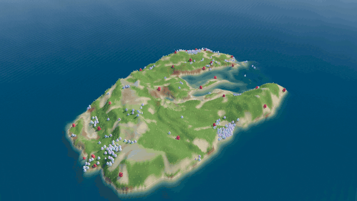

# Common Ground

Prey flock, hunters hunt, and the ground remembers where they went.



**Live:** https://molegod.github.io/DEA4197Project1/ (once GitHub Pages is switched on, see below)

Two populations of little blob creatures live on an island in an open sea. The island is a different shape in every world, and
its fractal-noise hills slowly reshape themselves. Nothing is in charge and nothing is scripted: every creature only reacts to
what's right around it. As they move they dig and pile dirt, graze the grass down and leave scent, and those changes feed back
into how everyone else moves. Over generations their genes drift. You can orbit around the island, follow a single creature,
and reach in with your mouse (or your hand, on a webcam) to pick creatures up and throw them.

## The rules, in plain language

**Prey**
- Stay near your neighbours, don't bump into them, and go the way they go.
- See a hunter? Run. A neighbour panicking? Panic too.
- Hungry: head for grass. Full: walk the worn paths, they're easier. Thirsty: walk downhill to the water and drink.

**Hunters**
- Keep away from other hunters.
- Chase the nearest prey you can see. Tall grass hides prey, and lunging into a crowd often misses.
- Nothing in sight? Follow fresh prey tracks.

**Everyone**
- Moving costs energy, eating gives it back. Run out and you die.
- With enough energy you split in two. The child's genes (speed, eyesight, how much it likes the group, how jumpy it is) come out slightly different.

**The ground**
- The hills slowly shift. Uphill is slow, water counts as uphill, and low ground pulls you in. The sea is the edge of the
  world: nobody is fenced in, they just don't like swimming.
- Like water eroding a hillside: moving fast picks up dirt, some gets kicked aside, and slowing down drops the rest. Busy routes sink, and sunken ground pulls in more walkers.
- Grass regrows, fastest near water. Trampled ground stays bare.

### The 30-second version (for presenting without slides)

> "There are two kinds of creatures. The prey follow three bird rules: stay close, don't collide, go the same way. They also run
> from hunters, and if a neighbour panics they panic too. The hunters chase whatever prey is nearest, but they miss a lot when
> they lunge into a crowd. Everyone burns energy, eats, and splits in two when they have enough, and the child is slightly
> different. The ground works like a river: walking fast kicks up dirt, slowing down drops it, so busy routes wear into gullies
> that pull more walkers in. Nobody is told to herd, migrate or evolve, and they do anyway."

## What emerges

These came out of the rules; none of them are written into the code:

- **Flocking pays off.** Evolution pushes prey cohesion up (roughly 0.45 → 0.9 over ~15 minutes), because hunters miss in crowds and panic travels through a herd faster than any one prey can see.
- **An arms race.** Prey and hunter top speeds climb together (about 1.7 → 3.0 and 2.1 → 3.5+).
- **Boom and bust.** On many maps the populations cycle: prey boom, hunters follow, prey crash, hunters starve, grass recovers. Watch the graphs in the panel.
- **Worn land.** Gullies form downhill toward the water where thirsty herds travel. Grazing grounds go bare with dark banks of kicked-up dirt, and heal in the lean years.
- **Coastal herds.** Prey crowd the shore, where the grass grows best — which is also where hunters wait.
- **A landscape of fear.** Hunter scent lingers as a red haze. Prey avoid it, so grass grows back where hunters patrol.
- **Panic waves** ripple through herds (panicking prey go pale and wide-eyed).

## Controls

| Input | Does |
| --- | --- |
| drag a creature | pick it up; let go while moving to throw it |
| drag / right-drag / scroll | orbit / pan / zoom the camera |
| `g` | follow a hunter, then a prey, then back to the free camera |
| `o` | slowly orbit the board |
| `0` | reset the view |
| ✋ Hands / `h` | webcam hand tracking: pinch thumb and index finger to pick up, open to drop |
| `1` / `2` | drop 12 new prey / a new hunter where the cursor points (fresh genes) |
| `space` | pause |
| `f` | speed 1× → 2× → 4× → 8× |
| `c` | color by family line / speed gene / eyesight gene |
| `t` | show or hide scent |
| `r` | new world |
| `i` | hide the panel |
| `?` | rules |
| `v` | record 12 seconds of video |

URL options: `?seed=123` for a specific world, `?clean` to hide the interface.

## Running it

It's plain HTML and JavaScript modules with no build step, but modules need a web server:

```sh
cd final_project_one
python3 -m http.server 8000
# open http://localhost:8000
```

Hand tracking needs camera permission, which browsers only grant on `localhost` or `https` (GitHub Pages is fine). It loads
[MediaPipe Hands](https://ai.google.dev/edge/mediapipe/solutions/vision/hand_landmarker) from a CDN the first time you turn it on.
Needs a browser with WebGL2 (any current Chrome, Edge, Firefox or Safari). [Three.js](https://threejs.org) loads from a CDN.

## Putting it on GitHub Pages

1. This folder is the repository root of [DEA4197Project1](https://github.com/molegod/DEA4197Project1).
2. Repository → **Settings → Pages** → Source: *Deploy from a branch* → pick `main` and `/ (root)`.
3. After a minute it's live at https://molegod.github.io/DEA4197Project1/.

## How it's built

| File | What's in it |
| --- | --- |
| `src/config.js` | every tunable number, with comments |
| `src/noise.js` | fBm + domain-warped terrain |
| `src/world.js` | the ground grid: hill height, moved dirt, grass, prey tracks, hunter scent |
| `src/creatures.js` | the prey and hunter rules, genes, and the erosion rule |
| `src/sim.js` | birth, death, catching, immigration, stats; runs without a browser |
| `src/view/stage.js` | renderer, lights, camera, orbit controls, the bloom pass and the buffer the water refracts |
| `src/view/sky.js` | the procedural sky: the backdrop, the light that fills the shadows, and what the sea reflects |
| `src/view/water.js` | the sea: Gerstner waves on a camera-centred grid, refraction, depth colour and surf |
| `src/view/land.js` | the island: terrain mesh rebuilt from the simulation's grid, and the grass |
| `src/view/blobs.js` | the creatures as instanced blobs with eyes (and brows), catch poofs, cursor rings |
| `src/hands.js` | webcam pinch detection with MediaPipe |
| `src/hud.js` | population graphs and gene meters |
| `tools/render-hunt.cjs` | finds a good hunt in a world and films it close up (this made the teaser) |
| `tools/render-teaser.cjs` | renders a wide tour of the island frame by frame |

The simulation is 2D (creatures move over a height map) and steps 60 times a second no matter the frame rate; the 3D view just
draws it. The terrain mesh's vertices are the simulation's grid cells, so grooves the creatures dig show up as real dips in the
ground. Creatures, eyes and grass are instanced meshes, so a thousand blobs draw in a handful of calls.

The island is the same noise as before, faded out into a sea bed by a mask that is itself made of noise — one field read around
the compass for headlands and coves, one read across the board so it isn't a disc. How many creatures a world starts with is
worked out from how much dry land that mask left.

**How it's drawn.** Real ray tracing isn't available in a browser, so the things that actually make a difference here are:
a procedural sky baked into a cube map, which lights every shaded side instead of a flat ambient term; a filmic tone map and a
bloom pass, so bright things spill the way a camera does; and water that earns its keep. The sea is four Gerstner waves on a
disc of triangles re-centred on the camera every frame, so the mesh is dense underfoot and coarse at the horizon. Before the
water is drawn the scene goes into a half-size buffer, and the water shader reads it back bent by the wave slope and dimmed
with depth — red first, then green — so sand shows through the shallows, the deep goes blue, and anything wading gets surf
around it. That is one extra half-size pass, and the whole thing holds 60 fps.

To regenerate the teaser: serve the folder, then `node tools/render-hunt.cjs scan 314` to list the best hunts in that world and
`node tools/render-hunt.cjs render …` to film one (both commands are printed for you, with the ffmpeg lines, at the top of the
file).

## References

- The Book of Shaders, [ch. 13 Fractal Brownian Motion](https://thebookofshaders.com/13/) (terrain, domain warping)
- The Nature of Code, [Example 5.11 Flocking](https://natureofcode.com/autonomous-agents/#example-511-flocking) and [Example 9.5 An Evolving Ecosystem](https://natureofcode.com/genetic-algorithms/#example-95-an-evolving-ecosystem)
- Craig Reynolds, *Flocks, Herds, and Schools* (1987)
- Dirk Helbing et al., *Modelling the evolution of human trail systems* (Nature, 1997), for the idea that paths attract walkers
- Look inspired by [Primer](https://www.youtube.com/@PrimerBlobs)'s blob simulations
- Hand interaction inspired by Kern Kelley's [v6 Puppet](https://openprocessing.org/sketch/2982807)
